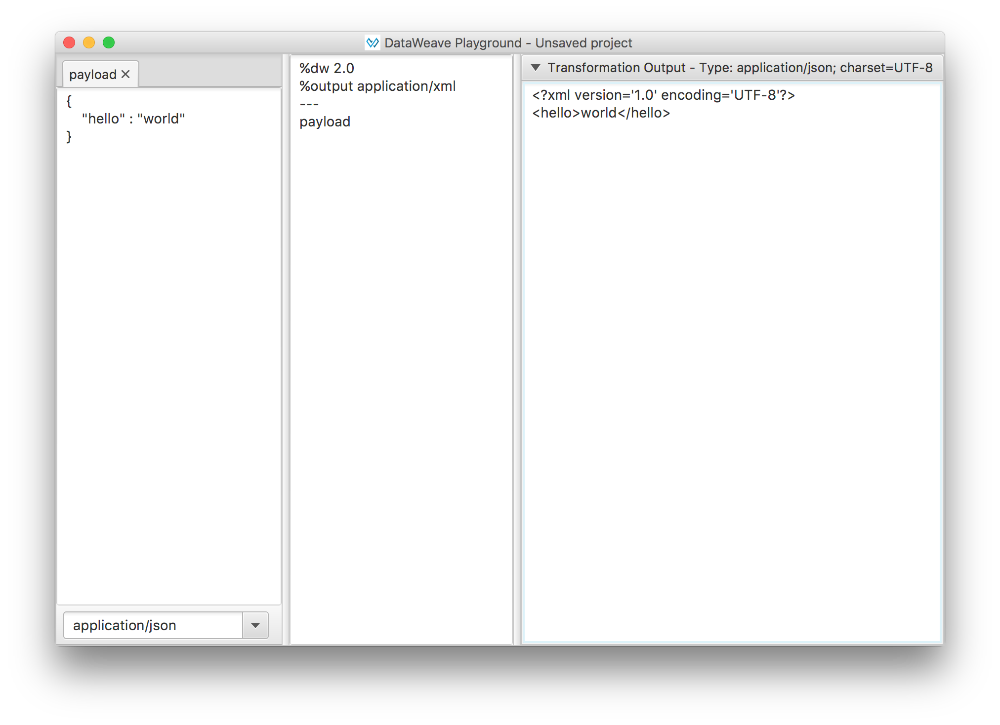

# DataWeave Playground

## For Online Playgroung please visit http://dwlang.fun/


### First Open Source DataWeave Playground

### What is the DataWeave Playground?

Is a tool for quick and easy development of DataWeave scripts



### Features

* Save and Open DataWeave Playground projects (**.dwp** files), to not loose the progress of your transformations.
* Able to quickly modify your input data selecting the correspondent mimeType and see instantly the result of your transformation.

### Missing Features
* Code areas with highlighting
* Auto formatting for DataWeave scripts
* Add multiple inputs
* Export application as a native one
* DataWeave script validation

## How to run the application

To run the DataWeave Playground using maven, execute the following command:

```mvn exec:java -Dexec.mainClass="com.github.estebanwasinger.DWPlayground"```

Disclaimer: It is not an officially supported MuleSoft Product. It is not supported by MuleSoft Support, you won't be able to open MuleSoft Support cases for this Suite and there are no SLAs for responses nor bug/features progress.
