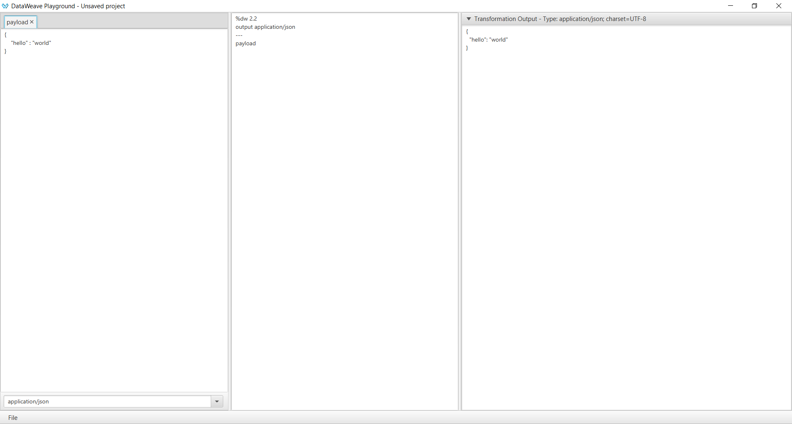

# DataWeave Playground
### First Open Source DataWeave Playground

### What is the DataWeave Playground?

Is a tool for quick and easy development of DataWeave scripts



### Features

* Save and Open DataWeave Playground projects (**.dwp** files), to not loose the progress of your transformations.
* Able to quickly modify your input data selecting the correspondent mimeType and see instantly the result of your transformation.
* Supports Dataweave 2.x(tested upto dw 2.2)

### Missing Features
* Code areas with highlighting
* Auto formatting for DataWeave scripts
* Add multiple inputs
* Export application as a native one
* DataWeave script validation

## How to run the application

To run the DataWeave Playground using maven, execute the following command:

```
mvn exec:java -Dexec.mainClass="com.github.estebanwasinger.DWPlayground"
```

## How to generate a runnable jar to use directly

* To generate runnable dataweave-playground-1.0-SNAPSHOT-runnable.jar, execute the following command:

```
mvn clean package
```

* dataweave-playground-1.0-SNAPSHOT-runnable.jar will be generated under /target folder 
* Directly run dataweave-playground-1.0-SNAPSHOT-runnable.jar and develop dataweave scripts